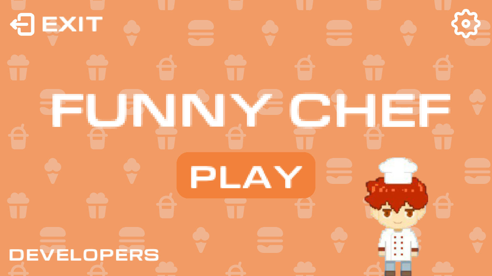
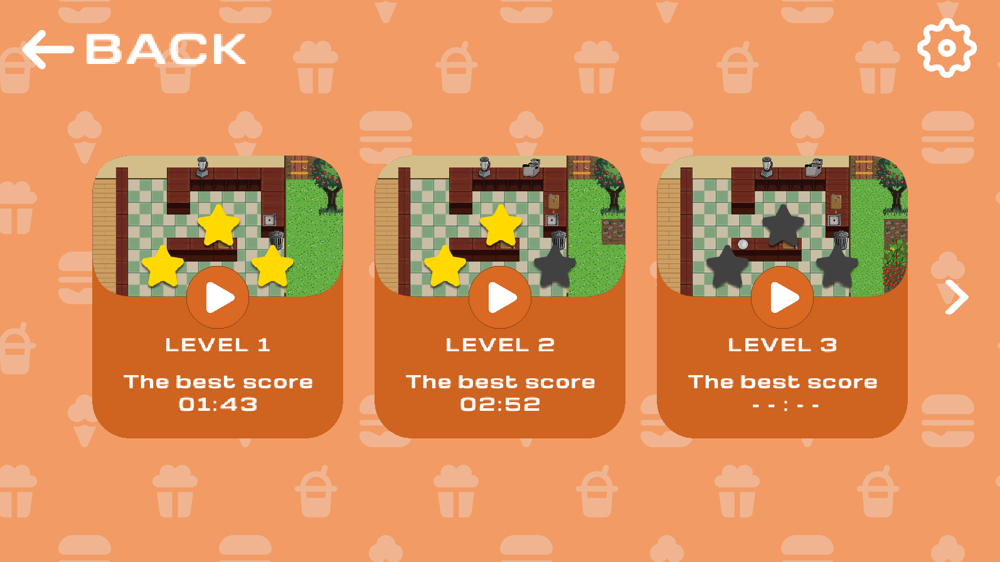
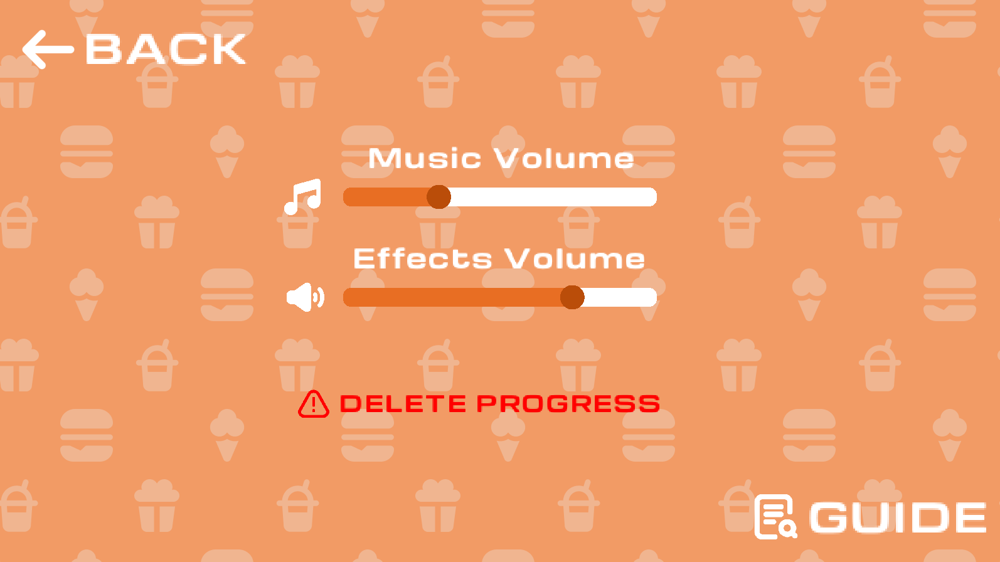
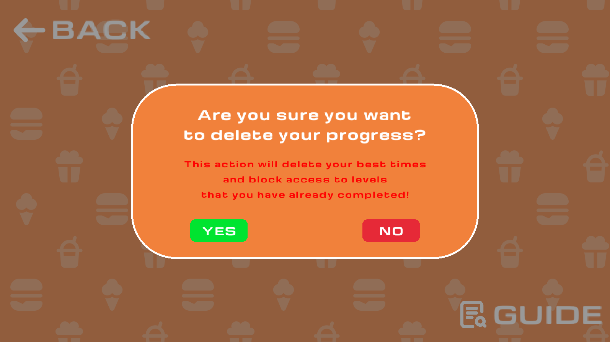
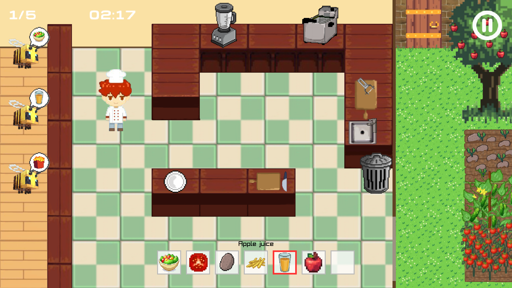
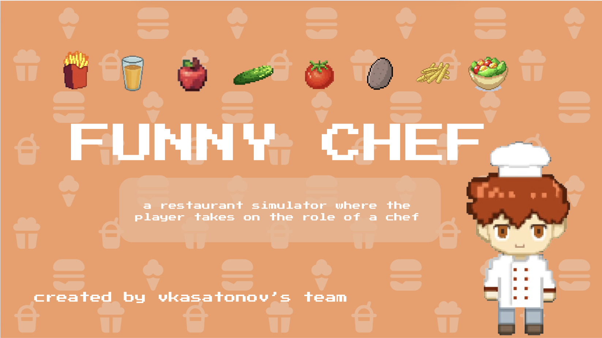

# EndGame  

<h3>Funny Chef | Innovation Campus Marathon | The project is based on C and Raylib</h3>

<table>
  <tr>
    <td align="left">🕹 <b>Game</b></td>
    <td align="center"><b>Funny Chef</b></td>
  </tr>
  <tr>
    <td align="left">📅 <b>Development Time</b></td>
    <td align="center"><b>7 days</b></td>
  </tr>
  <tr>
    <td align="left">🏆 <b>Marathon</b></td>
    <td align="center"><b>Innovation Campus by NTU KhPI</b></td>
  </tr>
  <tr>
    <td align="left">💻 <b>Language</b></td>
    <td align="center"><b>C</b></td>
  </tr>
  <tr>
    <td align="left">🖼 <b>Graphics Library</b></td>
    <td align="center"><b>Raylib</b></td>
  </tr>
</table> 

### Team members:
1. [Vladyslav Kasatonov](https://github.com/vldKasatonov)
2. [Albina Milshyna](https://github.com/milshyna-albina)
3. [Viktoriia Shaforostova](https://github.com/shenyaaw)
4. [Daniil Burlachenko](https://github.com/kamawui)
5. [Mariia Kashuashvili](https://github.com/kashuashvili)
6. [Mariia Mykhalchenko](https://github.com/mikhalchenko-m)

# 🍽️ Game Overview

 **Funny Chef** is a fast-paced **restaurant simulator** where every second counts! 🍟

### 🎯 Your Goal:  
✔️ Serve all visitors by preparing the correct dishes.  
✔️ Beat the clock – **the faster, the higher the score!**  
✔️ Progress through levels, unlocking **new recipes** and increasing the challenge.  

💡 This game tests your **reaction, multitasking and decision-making skills** in a fun and engaging way!  

# 🎮 Game Features

**Ready to cook?** Then jump in and get started with **Funny Chef** where every dish is a new adventure! 🍴

### 📜 **Menu**
Navigating through the game is as easy as flipping a pancake! 🥞  
The main menu is designed for smooth gameplay with everything you need at your fingertips:  

- **Play** 🟢 *(Start your culinary adventure here!)*  
- **Developers Info** 💻 
- **Exit** 🚪 *(Time to wrap it up?)*  
- **Settings** ⚙️ *(Customize your gameplay)*



Two modes are available:
- **Single-player** 🧑‍🍳
- **Two-player** 👥 *(Currently in development — stay tuned! 👀)*

Once you choose your mode, you’ll enter the **Level Menu**. Initially, only the first level is unlocked, but as you progress, more levels open up, allowing you to unlock new recipes and challenges!

To add a little extra challenge, your performance is rewarded with stars based on how quickly you complete each level:

- **Stars** 🌟 — Each level is timed and the number of stars you earn depends on how fast you complete it.
- The **best score** for each level is saved in the **Level Menu**, allowing you to track your progress and compete against yourself!



You can access the **Settings** from anywhere during the game. It includes:

- **Volume Control** 🔊 *(Adjust music and sound effects to your liking)*
- **Delete Progress** 🔄 *(Reset your records and start fresh)*
- **Guide** 📖 *(Learn about controls and cooking techniques)*

Once you exit the settings, you'll return to where you left off in the game.



🛑 When you want to exit the game, quit by pausing a level or delete progress, a pop-up confirmation window will appear, ensuring that you don’t make accidental mistakes.



### 🍳 **Gameplay:**

The gameplay evolves as you progress through the levels, each unlocking a new recipe! With each new dish, the challenges become more complex, keeping things fresh and exciting. 🌶️

If you're not sure how to prepare a dish, no worries! Just check the **Guide** for instructions on the cooking process. 📚

- **7-Slot Inventory** 🛠️ — Keep your ingredients stored and ready for action. You can use this to multitask and manage cooking multiple dishes simultaneously!
- **Unique Recipes** 🥗 — Each recipe requires specific tools and methods of preparation. Just like a real kitchen, different devices and techniques are required for different dishes.
- **Need a break?** ⏸️ You can pause or exit at any time, but keep in mind: **Your progress won’t be saved if you quit from a level**. So make sure you finish your level before calling it a day!

💡 **Tip:** Always follow the right cooking method! If you mix things up — for example, blending fries or frying an apple 🍏 — nothing will happen! Failure to follow the recipe will result in zero progress. 

Customers are picky! 😤 If you serve the wrong dish, they’ll refuse it and continue waiting for their correct order. Keep your eyes on the prize and stay focused!



# 📝 How to Run the Game

Follow the simple steps below to get started.

1. **Clone the project** to a folder on your device.
2. **Navigate to the project folder**.
> The Makefile contains commands for Linux and MacOS.
3. If you're using **Linux**, you can go the step 5.
4. If you're using **MacOS**, uncomment the MacOS line and comment out the Linux line to ensure successful compilation.
5. Open **Terminal** and type the following command to compile the game:
    ```bash
    make
    ```
6. After that, execute the following command to launch the game:
    ```bash
    ./endgame
    ```

🚀 Now you're ready to play **Funny Chef**!

# ⚙️Versions

- **v1.0.0** — Presented at the end of the Innovation Campus Marathon 💪
- **v1.1.0** — Added updates and fixed issues 🛠

# ⚡ToDo 
  
### 👨‍💻 Post-Project Enhancements (v1.1.0)
- **Fix Bugs**:
  - Resolve the issue with the aborted stream on the audio device ✅
  - Fix incorrect star display in certain situations ✅
  - Corect some item names ✅
  - Fix the incorrect timer behavior upon successful level completion ✅
- **Optimize the Project Size** by adding a pre-compiled static library ✅
- **Add Support** for running the project on **macOS** ✅
- **Implement Progressive Level Unlocking** ✅
- **Add a "Controls" Page** to the guide ✅
- **Add a Confirmation Window** for progress deletion ✅
- **Code Refactoring & Optimization** (in progress) ⚙️

### 🌎 Future Plans
- **New Levels & Recipes** 🍳
- **Additional Maps** 🗺️
- **Second Player** 👾
- **A NPC farmer** 🧑‍🌾
  
# 🎥 Video Tutorial 

<p>
  <a href="https://youtu.be/ucXP-eQB8OY?si=U2QzBfSf7OKh9TKp">
    
  </a>
</p>

<p align="left">
  📺 <a href="https://youtu.be/ucXP-eQB8OY?si=U2QzBfSf7OKh9TKp">Watch on YouTube</a>
</p>
